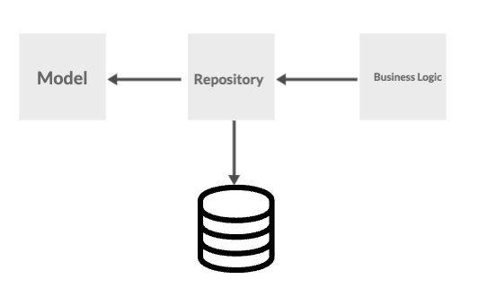

# Backend Engineering Interview Assignment (Golang) @lili_style

## Requirements

## Description
This is an shopping cart service implementation in Go (Golang)+ Gin projects. To create a simple shopping cart service for a small product store and identify, design & implement relevant APIs.

Architecture Ecah model has this below structure(eg: Product, favorites, User)



## Running

To run the project, run the following command:

```
docker-compose up --build
```

You should be able to access the API at http://localhost:8080

## Swagger

To access swagger:

```
http://localhost:8001/#/default/article
```

#### Add Product
```sh
curl --request POST \
  --url http://127.0.0.1:3000/product \
  --header 'Content-Type: application/json' \
  --header 'User-Agent: insomnia/2023.5.8' \
  --data '{
	"shop_id": 1,
	"name": "coba 2",
	"description": "Product 2 Desc",
	"thumbnail_url": "thum",
	"origin_price": 1,
	"discounted_price": 1,
	"status": "ada",
	"in_stock": 2,
	"is_preorder": 2,
	"is_purchasable": 2,
	"delivery_condition": "delivery condition 1",
	"delivery_display": "delivery display 1"
}'
```

#### Add User
```sh
curl --request POST \
  --url http://127.0.0.1:3000/user \
  --header 'Content-Type: application/json' \
  --header 'User-Agent: insomnia/2023.5.8' \
  --data '{
	"name": "user 1",
	"email": "ada@gmail.com",
	"password": "cobaaja",
	"phone": "08563213123",
	"status": "ada"
}'
```

#### Add Favorites
```sh
curl --request POST \
  --url http://127.0.0.1:3000/favorites \
  --header 'Content-Type: application/json' \
  --header 'User-Agent: insomnia/2023.5.8' \
  --data '{
	"code": "user 1",
	"prod_id": 2,
	"name": "cobaaja",
	"price": 1200,
	"items": 2
}'
```

#### Get Product
```sh
curl --request GET \
  --url http://127.0.0.1:3000/product \
  --header 'Content-Type: multipart/form-data' \
  --header 'User-Agent: insomnia/2023.5.8' \
  --form name=coba
```


## Testing

To run test, run the following command:

```
make test
```

## Missing from applicant:
### 1. unit test
### 2. implement JWT Token
### 3. Retrieve Product

# Apologize missing for list above, because time was time out 
